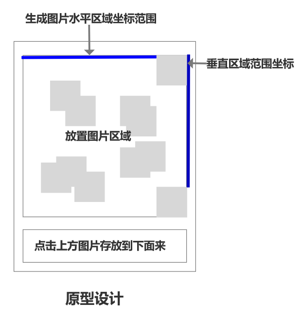
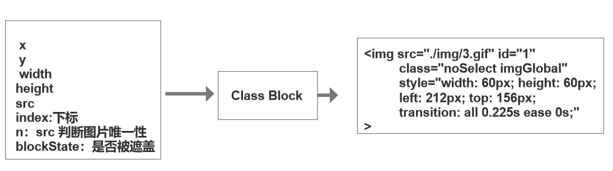
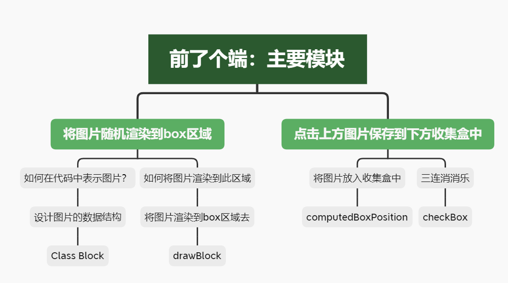

# 原型设计

# 设计实例
1.一共准备了七张图片，必须生成指定的图片个数=7*组数，这个组数必须是3的倍数
2.生成指定图片个数（总共有7张图片，三个相同才会消除，必须是三的倍数）
3.生成之后，打乱位置和顺序
4.是否被覆盖，如果被覆盖，呈现暗淡的效果以及不能被点击
5.点击上方的图片，把对应的图片放入收集盒子中，判断？是否有3个可以消除 
6.收集盒子内元素已经满了并且没有可以消除，表示游戏结束，你输了
  当收集盒子中的元素为空已经存放的图片的区域也为空，则表示胜利
## 图片渲染
1.图片位置需要随机生成-->生成区域  图片自身的位置和大小（x,y,height,weidth）
                    --> 生成位置的函数
2.图片的数据结构:设定了虚拟映射，这个游戏需要频繁的操作DOM src,  new Image()
       
        需要判断图片是不是被遮挡
        需要判断图片是否被遮盖:确定不会被遮盖的规则，然后从当前元素开始，与后来的图片元素进行比较
        显示区域中的块-->路径，位置，大小，是否被隐藏 
        [1,2,3]
        0,1,2
        需要定义点击事件
## 消消乐
1.将图片的放入收集盒中，获取图片的坐标x,y
2.有三个相同的图片，则消除，从DOM中删除掉
收集盒：需要定义一个数组hasBlockArr，将被点击的图片的数据放入收集盒，并从原来box的数组中删掉此元素
消消乐：定义一个对象:图片的属性n(src)作为key,保证唯一性，值为数组，当key值相同时（同一张图片），则将遮盖图片push进入数组中。n:[]，如果数组中的元素长度为3，进行消除

# 功能划分与主要函数

# 实现步骤

 第一步：将图片动态的渲染在页面上
 第二步：计算出图片可以随机拜访的区域 ，位置->坐标(x,y) x最大值app-width-box margin left，最小值20，y值最大值app-storageBox.height-storageBox.margin top和bottom-图片height,最小值20
 第三步：判断是否被遮挡，先判断不会被遮挡的四种情况，然后取反 两者没有交叉的情况：
        1、0的x > 1的x+自身的宽度               0表示当前元素，1表示目标元素
        2、0的x+自身的宽度 < 1的x
        3、0的y > 1的y+自身的高度
        4、0的y+自身的高度 < 1的y
第四步：实现点击将图片放到收集框中去
        一、移动收集盒当中
        1、获取到收集盒子存放第一张图片的位置 收集盒-app+10
        2、判断收集盒是否为空
            2.1、如果为空，直接放入Block块进去
            2.2、如果不为空，判断是否有相同的元素存在
                2.2.1、如果没有，直接塞入
                2.2.2、如果有，就后面的元素向后移动一个位置，并且将当前点击的元素插入到当前位置

第五步：实现消除的功能
        1、验证，是否已经三个相同的
                1.1、如果有的，那么就清除掉
        2、清除掉之后，将后面的元素全部移上来
        3、判断，收集盒中元素以及allBlock中的元素
            3.1、如果收集盒中的元素已经达到7个，表示输了
            3.2、如果收集盒中的元素没有了，并且allBlock中的也没有元素了，表示赢了
        4、游戏结束
